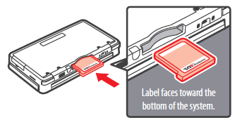

# CAMEL-HARNESS-LIB

# this project is archived and no longer maintained. the successor project, kcar, can be found [here](https://github.com/davidholiday/kcar)


### what is this? 

This is the core library for __Harness__, a featherweight microservices framework for [Apache Camel](http://camel.apache.org/). It contains several "Harness" classes that, along with a few helpers, constitute the backbone of the framework. An reference implementation is available [__here__](https://github.com/davidholiday/camel-harness). 

__Camel + Harness gives you__:
* plug-and-play insertion of Camel objects into a 'Harness' that provides boiler-plate code required for route creation, registry management, and testing. 

* the ability to communicate with pretty much anything you can think of out of the box - MQs, caches, RESTful services, etc etc etc. There are are [lots](http://camel.apache.org/component-list.html) of ready-made connectors that facilitate this. 

* the ability to rapidly create new business logic with very little code. This because between Camel and Harness most of what you might need is already provided.

* a strong measure of consistency in Harnessed Camel services at scale of mass-production.

* the ability to have many developers cooking in the same kitchen without nasty marge conflicts. Any new logic that needs to be implemented is is framed in terms of an assembly of uni-directional pipes that receive, process, and forward data. Developers can work on individual components of that plumbing without impacting the rest of the team's velocity. 

* the benefit of implementing an IoC framework like Guice w/o the bloat of using an IoC framework like Guice. Through the use of ```*.properties``` files the app can inject mocks, different processors, and even re-wire the business logic.

* the ability to alter app behavior at runtime. Harness uses [Netflix Archaius](http://netflix.github.io/archaius/) which allows for dynamic loading of app properties. The framework provides a means of responding to property change events by reconfiguring, removing, or even adding business logic without shutting down the app or impacting anything else the app might be doing. 

* an automagick way to ensure routes are named something that a human can understand and use to find the code for. Makes log parsing and dynamic behavior management much easier. 

* the ability to rapidly create a fleet of battle-ready microservices that are truely that - self-contained, resilient when communication or the environment doesn't behave as expected, and featherweight in terms of both size and resource consumption. 
 
* the ability to ignore the framework whenever you want with zero bs. *It's there when you need it, invisible when you don't.*


### what exactly is a "Harness" ?

A Harness is an abstract class that provides implementors with pre-baked code to handle common tasks. Often Camel objects are inserted into a harness via a default constructor which injects the provided objects into the common logic contained in the harness.

Another way to think of the relationship between a harness and the harnessed class is to frame it in terms of the relationship between a [gameboy](https://en.wikipedia.org/wiki/Game_Boy_family) and a game cartridge. 




The gameboy has all of the components necessary to make a given game experience work (screen, buttons, circuitry, etc). A game cartridge is the only thing missing as it represents the only thing that might change from session to session. The *gameboy* is therefore the *Harness* and the *cartridge* is the *Camel object* we plug in in order to make the whole thing work. 


### what Harnesses are provided by this library?

* __CamelContextLifecycleHarness__ provides a means of overriding any of the methods in the CamelContextLifecycle object with new behavior depending on state of constructor boolean argument. This includes modifying the contents of the JNDI registry. See contents of package ```com.davidholiday.camel.harness.test.context.lifecycle``` for an example. 

* __RouteBuilderHarness__ provides a set of names and methods to facilitate creation of routebuilder objects that conform to a standard other harnesses can automatically operate on. Automatically ensures all routes are named something that a human can understand, use to reference the source code for, and algorithmically manipulate. See ```RouteBuilderHarness``` for detail. 

* __RouteTestHarness__ for ```RouteBuilders``` harnessed by ```RouteBuilderHarness``` this provides a means of testing the business-logic segment (the part of the route that doesn't involve reading/pushing data to/from a data source). The harness wraps the target route in a meta route that includes nodes before and after the target route into which pre/post processing logic of exchange contents can be injected. See contents of package ```com.davidholiday.camel.harness.test.routes``` for an example. 

* __ProcessorTestHarness__ does exactly what RouteTestHarness does for RouteBuilders, only this works with unharnessed Processors. The reason RouteBuilders have to be harnessed is because some standardization is required in the RouteBuilders if the RouteTestHarness is going to know what to test and what to ignore. Processors are inherently always testable so they don't require a harness. See contents of package ```com.davidholiday.camel.harness.test.processor``` for an example. 

* __TestHarness__ is the base class for all TestHarnesses and contains a lot of the logic that makes the testing magicks happen. see ```TestHarness``` for detail.


### what else is here? 

* package ```com.davidholiday.camel.harness.config``` contains classes that listen for and respond to config property change events.

* package ```com.davidholiday.camel.harness.helpers``` contains classes that help load mock files and make checking an ordered list of property file locations possible.
